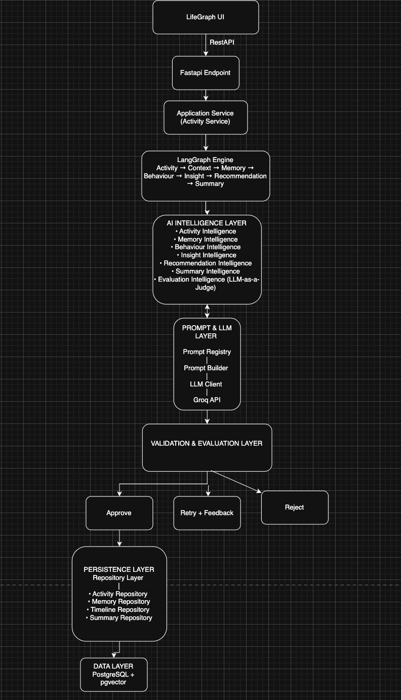

# LifeGraph

**AI-Powered Personal Intelligence Engine**

LifeGraph transforms natural-language activity logs into an evolving, evidence-backed
understanding of how a user works, learns, and decides — producing explainable insights
and personalized recommendations instead of raw activity statistics.

<p>
  
  
  
  
  
</p>

> **The LLM reasons. The application decides.**

## Live Demo

| | URL |
| --- | --- |
| 🌐 **App (frontend)** | https://life-graph-one.vercel.app |
| ⚙️ **API (backend)** | https://lifegraph.onrender.com · [`/health`](https://lifegraph.onrender.com/health) · [`/docs`](https://lifegraph.onrender.com/docs) |

> ℹ️ The backend runs on Render's free tier, which sleeps after ~15 min of
> inactivity — the first request may take 30–60s to cold-start, then it's fast.

---

## The Problem

Every activity tracker on the market answers the wrong question. They tell you **what**
you did — hours logged, tasks counted, charts of your week — but never **what it means**.

- **Statistics, not understanding.** "You spent 6 hours in your editor" is data, not insight.
- **No memory.** Each day is analyzed in isolation; the tool never learns who you are.
- **Generic advice.** "Take more breaks" is not grounded in *your* behaviour.
- **Black-box AI.** When a tool does use AI, it can't explain *why* it concluded anything.

The result is dashboards people glance at once and abandon. What's missing is a system
that actually *understands* the person behind the activity and can justify every claim it
makes.

## The Solution

LifeGraph is a personal intelligence engine that turns a stream of plain-language logs
("Worked on the API for two hours", "Team standup", "Went for a run") into an evolving,
explainable model of the individual.

Its design is governed by a single principle — **the LLM reasons, the application
decides**:

- **LLMs handle cognition** — interpreting messy language, detecting behavioural patterns,
  writing narratives.
- **Deterministic code handles control** — orchestration, validation, evidence
  accounting, and persistence. Nothing an LLM proposes is trusted blindly.

What that buys the user:

| Principle | What it means in practice |
| --- | --- |
| **Explainable** | Every insight cites the evidence it was drawn from — never opaque IDs, always plain language. |
| **Evidence-earned memory** | Facts about you are *earned* from repeated observation, not asserted from a single log. |
| **Personalized** | Recommendations are grounded in your own history — "your focus peaks 9–12", not "work harder". |
| **Self-critiquing** | An LLM-as-a-judge evaluates every reasoning step and can force a retry or reject a weak result. |
| **Day-aware** | Summaries are generated and stored per day, browsable through a calendar. |

## System Architecture

A strict, one-directional pipeline: the UI never touches the database, and the LLM never
touches control flow. Each request flows down through orchestration, reasoning, validation,
and persistence — with an evaluation gate that can **approve, retry, or reject** any
AI-produced result before it is written.



**Flow, top to bottom:**

1. **UI → FastAPI → Application Service.** Thin REST layer accepts a natural-language log.
2. **LangGraph Engine.** Orchestrates the reasoning pipeline as a stateful graph:
   `Activity → Context → Memory → Behaviour → Insight → Recommendation → Summary`.
3. **AI Intelligence Layer.** One focused service per task — Activity, Memory, Behaviour,
   Insight, Recommendation, Summary, and an **Evaluation (LLM-as-a-Judge)** service.
4. **Prompt & LLM Layer.** Versioned prompt registry + builder feed a provider-independent
   LLM client (Groq today).
5. **Validation & Evaluation Layer.** Every proposal is judged → **Approve / Retry +
   Feedback / Reject**. Only approved results proceed.
6. **Persistence Layer → Data Layer.** Repositories (Activity, Memory, Timeline, Summary)
   write to **PostgreSQL + pgvector** (SQLite for local dev/tests).

> **Dependency rule:** dependencies flow downward only —
> `api → graph → intelligence → validators → repositories → database`.

## Memory Architecture

LifeGraph's differentiator is **memory that is earned, not asserted.** A single activity
never becomes a belief about you. Observations accumulate into episodic records, repeated
evidence is distilled into semantic knowledge, and confidence rises only with corroboration.
Relevant memories are then retrieved and injected into future reasoning runs — so the system
gets sharper the more you use it.

```
                    USER ACTIVITIES
                           │
                           ▼
                 Natural Language Logs
                           │
                           ▼
                 Activity Intelligence
                           │
                           ▼
                    Structured Activity
                           │
                           ▼
                    Working Memory
                (LifeGraphState)
                           │
          ┌────────────────┼────────────────┐
          ▼                ▼                ▼
Current Activity     Current Context    AI Proposals
          │
          ▼
──────────────────────────────────────────────
             Episodic Memory
──────────────────────────────────────────────
Activities
Timeline
Sessions
Daily Summaries
Recommendations
Insights
          │
          ▼
      Evidence Builder
          │
          ▼
Repeated Observations
          │
          ▼
Behaviour Detection
          │
          ▼
──────────────────────────────────────────────
             Semantic Memory
──────────────────────────────────────────────
Preferences
Interests
Goals
Projects
Skills
Habits
Working Style
Decision Patterns
          │
          ▼
Memory Confidence Update
          │
          ▼
Memory Retrieval Engine
          │
          ▼
Relevant Memories
          │
          ▼
Injected into Future Graph Runs
```

**Three tiers of memory:**

- **Working memory** (`LifeGraphState`) — the transient scratchpad for a single graph run:
  the current activity, its context, and in-flight AI proposals.
- **Episodic memory** — the durable record of *what happened*: activities, timelines,
  sessions, daily summaries, insights, and recommendations.
- **Semantic memory** — *what is known about you*: preferences, goals, habits, working
  style, and decision patterns, each carrying a confidence score.

The **Evidence Builder** watches for repeated observations, **Behaviour Detection** turns
them into candidate patterns, and each corroboration nudges the **memory confidence** upward.
At reasoning time the **Memory Retrieval Engine** surfaces the most relevant memories and
injects them back into the graph, closing the loop.

## Tech Stack

| Layer         | Technology                                                     |
| ------------- | -------------------------------------------------------------- |
| Frontend      | React + Vite · Tailwind CSS · shadcn/ui · Google OAuth         |
| API           | FastAPI                                                        |
| Orchestration | LangGraph (stateful reasoning graph)                           |
| Reasoning     | Groq LLM (provider-independent client)                         |
| Validation    | Pydantic v2 · LLM-as-a-Judge evaluation                        |
| Persistence   | SQLModel · Neon Postgres + pgvector (SQLite for local/tests)   |
| Tooling       | pytest · Ruff · Docker · GitHub Actions CI                     |

**Repository layout**

```
backend/
├── app/
│   ├── api/            # REST routers (thin)
│   ├── config/         # settings, logging, constants
│   ├── graph/          # LangGraph engine: state, nodes, edges, builder
│   ├── intelligence/   # AI reasoning services (one task each)
│   ├── prompts/        # versioned prompt definitions, templates, tests
│   ├── repositories/   # persistence (CRUD)
│   ├── database/       # SQLModel entities, session
│   ├── schemas/        # API request/response DTOs
│   ├── models/         # domain models
│   └── main.py         # FastAPI entrypoint
├── tests/              # pytest suite
├── Dockerfile
└── requirements.txt
frontend/               # React + Vite SPA
docs/                   # engineering specification + assets
```

## Local Setup

### Prerequisites

- Python **3.12+**
- Node.js **18+**
- (Optional) A **Groq API key** for the reasoning layer, and a **Postgres** URL for
  production-like persistence. Local runs fall back to SQLite.

### Backend

```bash
cd backend
python -m venv .venv
source .venv/bin/activate
pip install -r requirements-dev.txt
cp .env.example .env            # set GROQ_API_KEY, DATABASE_URL, CORS_ORIGINS
uvicorn app.main:app --reload   # http://localhost:8000
```

Verify: `curl http://localhost:8000/health` → `{"status":"ok",...}`
Interactive API docs: <http://localhost:8000/docs>

### Frontend

```bash
cd frontend
npm install
cp .env.example .env            # set VITE_API_URL, VITE_GOOGLE_CLIENT_ID
npm run dev                     # http://localhost:5173
```

### Tests

```bash
cd backend && pytest            # backend suite
cd frontend && npm run build    # type-check + production build
```

### Key environment variables

| Variable              | Where     | Purpose                                             |
| --------------------- | --------- | --------------------------------------------------- |
| `GROQ_API_KEY`        | backend   | Enables the AI reasoning layer                      |
| `DATABASE_URL`        | backend   | Postgres connection (omit to use local SQLite)      |
| `CORS_ORIGINS`        | backend   | JSON array of allowed frontend origins              |
| `VITE_API_URL`        | frontend  | Base URL of the backend API                         |
| `VITE_GOOGLE_CLIENT_ID` | frontend | Google OAuth client ID                             |

## Conclusion

Most tools measure your activity. **LifeGraph tries to understand it.**

By pairing LLM reasoning with deterministic control — and treating memory as something
*earned* through evidence rather than asserted — LifeGraph produces insights it can
explain, advice grounded in your actual behaviour, and an understanding of you that
compounds over time. It is a blueprint for a category of software that is transparent by
construction: the machine reasons, but the application always decides.

---

<sub>See [`docs/`](docs/) for the full engineering specification.
`docs/13_MASTER_IMPLEMENTATION_SPEC.md` is the source of truth;
`docs/12_IMPLEMENTATION_PHASES.md` defines the build order.</sub>
