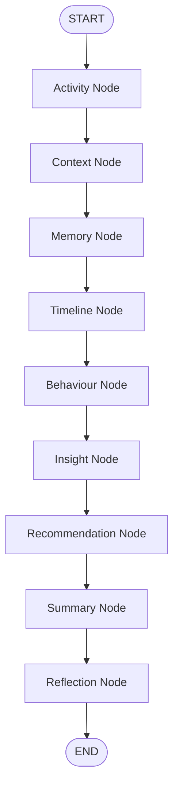
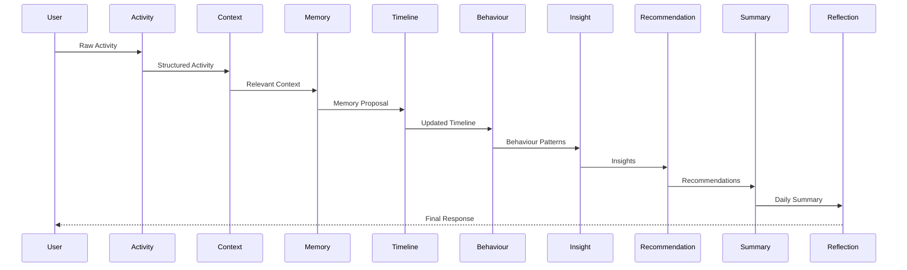
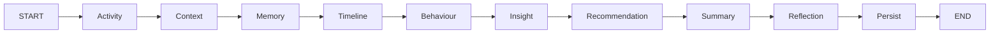
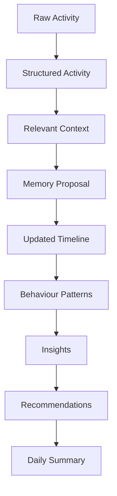
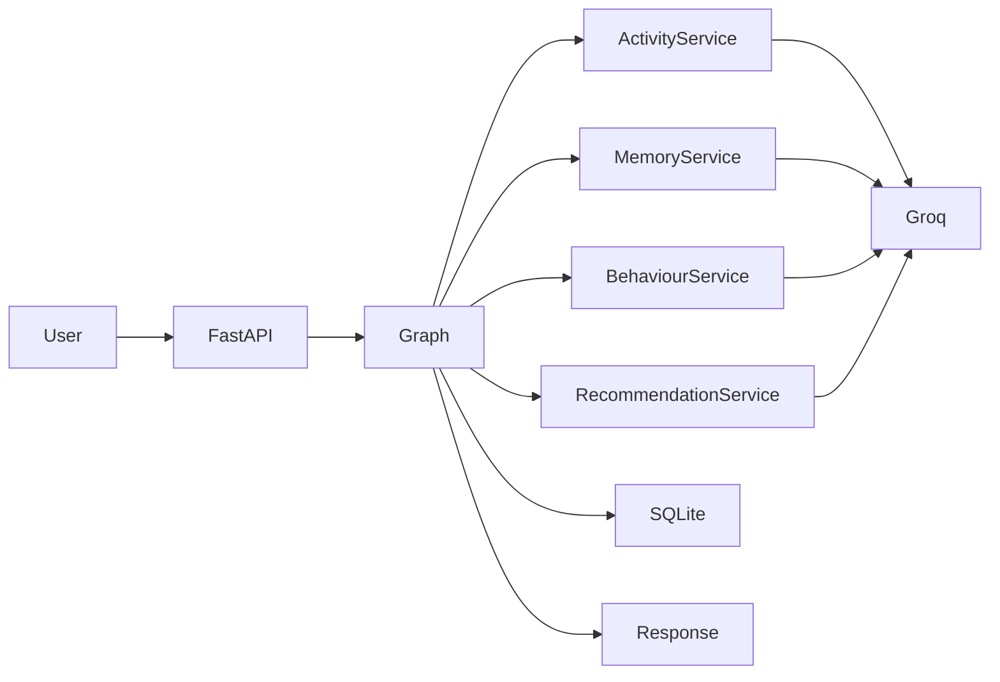

# Graph Design

## Project

**LifeGraph — AI-Powered Personal Intelligence Engine**

**Document Version:** 1.0

**Architecture:** LangGraph StateGraph

**Status:** Approved

---

# 1. Purpose

This document defines the complete execution model of LifeGraph using LangGraph.

Unlike a traditional REST application where requests are handled by independent service calls, LifeGraph executes every user activity through a deterministic reasoning workflow.

The graph represents the "thinking process" of the application.

Instead of asking a single LLM prompt to solve multiple problems simultaneously, the graph decomposes reasoning into small, specialized nodes that cooperate through a shared state.

This design provides:

* Explainable execution
* Modular reasoning
* Persistent memory
* Better testing
* Easier debugging
* Extensibility
* Deterministic orchestration

---

# 2. Why LangGraph?

LifeGraph is fundamentally a **reasoning pipeline**, not a chatbot.

A single activity moves through multiple stages of understanding before it becomes long-term knowledge.

For example:

```text
Worked on LifeGraph backend for 2 hours.
```

This single sentence must answer many independent questions:

* What was the activity?
* Which project?
* How long?
* Is this evidence?
* Does memory change?
* Does behavior change?
* Does a new insight emerge?
* Should recommendations change?

Trying to answer every question inside one prompt leads to:

* Large prompts
* Lower reliability
* Difficult debugging
* Poor modularity

Instead, LangGraph allows each reasoning step to become an independent node.

---

# 3. Graph Philosophy

Every node should answer **one question only**.

Examples:

Activity Node

> What happened?

Memory Node

> Did we learn something?

Behaviour Node

> What pattern exists?

Insight Node

> What observation should be communicated?

Recommendation Node

> What action should be suggested?

Summary Node

> How should today's story be written?

This separation dramatically improves maintainability.

---

# 4. Core Design Principles

The graph follows five engineering principles.

## Principle 1 — Shared State

Every node receives the same state object.

No node communicates directly with another node.

Instead:

```text
State

↓

Node

↓

Updated State

↓

Next Node
```

This prevents tight coupling.

---

## Principle 2 — Single Responsibility

Each node performs exactly one reasoning task.

Examples:

ActivityNode

Only understands activities.

MemoryNode

Only evaluates memory.

SummaryNode

Only generates narrative output.

---

## Principle 3 — Deterministic Workflow

Graph execution order is predefined.

Version 1 intentionally avoids autonomous planning or dynamic graph construction.

Every activity follows the same execution path.

---

## Principle 4 — Explainability

Every node should produce outputs that can be inspected.

Examples

Activity Node

* category
* confidence
* extracted project

Memory Node

* proposed memory
* evidence count
* confidence

Recommendation Node

* recommendation
* reasoning
* expected impact

Nothing should be hidden.

---

## Principle 5 — Replaceable Intelligence

Nodes never communicate directly with Groq.

Instead:

```text
Node

↓

Intelligence Service

↓

LLM Provider

↓

Validated Response

↓

Node
```

This allows replacing Groq with:

* OpenAI
* Claude
* Gemini
* Local models

without changing graph logic.

---

# 5. Overall Graph

The Version 1 graph is intentionally linear.



This sequence mirrors the natural reasoning process of the system.

Future versions may introduce conditional branches and parallel execution.

---

# 6. Central Graph State

The entire application revolves around one object:

> **Graph State**

The graph state represents the current understanding of the user during execution.

Every node receives it.

Every node returns it.

Nothing is passed through global variables.

Nothing is hidden.

---

# 7. Graph State Philosophy

Think of Graph State as the application's working memory.

It contains:

* Current activity
* User profile
* Timeline
* Memory
* Behaviour
* Insights
* Recommendations
* Summary

Instead of moving data between dozens of services, the graph continuously enriches this state.

---

# 8. Graph State Schema

The following conceptual model defines the state.

```python
GraphState

current_activity

structured_activity

user_profile

relevant_context

timeline

memories

memory_proposals

behaviour_patterns

insights

recommendations

daily_summary

execution_metadata

confidence_scores

errors
```

Each field has a clearly defined owner.

---

# 9. State Ownership

To prevent accidental mutation, ownership is explicit.

| State Field         | Owner Node          |
| ------------------- | ------------------- |
| current_activity    | Activity Node       |
| structured_activity | Activity Node       |
| relevant_context    | Context Node        |
| memory_proposals    | Memory Node         |
| timeline            | Timeline Node       |
| behaviour_patterns  | Behaviour Node      |
| insights            | Insight Node        |
| recommendations     | Recommendation Node |
| daily_summary       | Summary Node        |
| execution_metadata  | Reflection Node     |

Nodes should update only the fields they own.

---

# 10. State Evolution

Graph State evolves throughout execution.

Initial State

```text
Raw Activity
```

↓

Activity Node

```text
Structured Activity
```

↓

Context Node

```text
Relevant User Context
```

↓

Memory Node

```text
Memory Proposal
```

↓

Timeline Node

```text
Updated Timeline
```

↓

Behaviour Node

```text
Behaviour Patterns
```

↓

Insight Node

```text
Insights
```

↓

Recommendation Node

```text
Recommendations
```

↓

Summary Node

```text
Narrative Summary
```

↓

Reflection Node

```text
Validated Final State
```

The state becomes progressively richer as it moves through the graph.

---

# 11. Execution Metadata

Every graph execution should record metadata for debugging and observability.

Recommended fields include:

* Execution ID
* User ID
* Timestamp
* Node Execution Times
* Total Runtime
* Prompt Versions
* Model Used
* Retry Count
* Validation Results
* Error Messages

This metadata should never influence reasoning.

Its purpose is observability.

---

# 12. Design Decision Summary

The graph is intentionally:

* Sequential
* Deterministic
* Modular
* Explainable
* Easy to test

Version 1 optimizes for engineering quality rather than maximum automation.

Future versions may introduce branching workflows, asynchronous execution, and human approval nodes without requiring architectural redesign because the shared state model remains unchanged.


# 13. Graph Nodes

Every node in the graph has one responsibility.

Nodes never communicate with each other.

Nodes communicate only through **GraphState**.

Every node follows this lifecycle:

```text
Receive GraphState
        │
        ▼
Validate Required Inputs
        │
        ▼
Execute Business Logic
        │
        ▼
(Optional) Call Intelligence Service
        │
        ▼
Validate Output
        │
        ▼
Update Owned State Fields
        │
        ▼
Return GraphState
```

---

# Node Interface Contract

Every node should conceptually implement the following interface.

```python
class GraphNode:

    def execute(
        self,
        state: GraphState
    ) -> GraphState:
        ...
```

The implementation language may differ, but every node should respect this contract.

---

# 14. Activity Node

## Purpose

Transform raw natural-language activity into a structured representation.

This is the only node responsible for understanding what the user actually did.

---

## Inputs

Reads

* current_activity

---

## Outputs

Updates

* structured_activity
* confidence_scores.activity

---

## Responsibilities

* Normalize activity text
* Detect activity type
* Detect category
* Detect duration
* Detect project
* Detect intent
* Extract entities
* Estimate confidence

---

## Intelligence Service

Uses

ActivityIntelligenceService

↓

Groq

↓

Validated JSON

---

## Failure Strategy

If JSON validation fails

↓

Retry

↓

Retry

↓

Return structured error

Never produce partially valid activities.

---

## Example

Input

```
Worked on authentication for LifeGraph for 2 hours.
```

Output

```
Category:
Deep Work

Project:
LifeGraph

Duration:
120

Intent:
Implementation

Confidence:
0.96
```

---

# 14a. Evaluation Node

## Purpose

Judge the Activity Node's proposal (LLM-as-a-judge) before the pipeline
continues. Positioned immediately after the Activity Node.

## Inputs

Reads

* current_activity
* structured_activity

## Outputs

Updates

* structured_activity (evaluation_score, evaluation_reason, retry_count, validated)

## Behaviour

Calls the EvaluationIntelligenceService, which returns an `EvaluationDecision`
(`approve | retry | reject`). The node writes the score/feedback onto the
activity and drives a **conditional edge**:

```text
Evaluation Node
      │
 ┌────┼──────────┐
 ▼    ▼          ▼
approve  retry   reject
 │       │        │
 ▼       ▼        ▼
Context  Activity  END/error
        (retry_reason injected, max 2 retries)
```

The Evaluation service only decides; the graph owns the retry loop and its cap
(2 quality-retries). Transport/JSON retries remain inside the intelligence
service. See docs/08 §14a.

---

# 15. Context Node

## Purpose

Retrieve only information required for understanding the current activity.

Context retrieval should be selective.

Large context windows reduce reasoning quality.

---

## Inputs

Reads

* structured_activity
* user_profile
* memories

---

## Outputs

Updates

* relevant_context

---

## Responsibilities

Retrieve

* Active project
* Goals
* Similar activities
* Stable routines
* User interests

Avoid unrelated information.

---

## Example

If the activity concerns coding

Retrieve

* Programming goals
* Active software project

Do NOT retrieve

* Fitness memories
* Reading history

---

# 16. Memory Node

## Purpose

Determine whether the current activity changes long-term understanding.

Memory is not event storage.

Memory is accumulated evidence.

---

## Inputs

Reads

* structured_activity
* relevant_context
* memories

---

## Outputs

Updates

* memory_proposals
* memories

---

## Responsibilities

Evaluate

* Is this new?
* Is this repeated?
* Does confidence increase?
* Does an existing memory change?
* Should a new memory be created?

---

## Memory Rule

Never create permanent memory from one observation.

Instead

Observation

↓

Evidence

↓

Pattern

↓

Memory

---

## Example

One activity

```
Read about LangGraph.
```

↓

Observation only.

Ten similar activities

↓

Interest in Agentic AI

↓

Memory.

---

# 17. Timeline Node

## Purpose

Maintain chronological history.

No AI reasoning occurs here.

---

## Inputs

Reads

* structured_activity

---

## Outputs

Updates

* timeline

---

## Responsibilities

* Store activity
* Sort by timestamp
* Merge sessions
* Calculate durations
* Build daily chronology

---

## Example Timeline

09:00

Coding

↓

11:30

Meeting

↓

13:00

Lunch

↓

14:00

Research

---

# 18. Behaviour Node

## Purpose

Detect behavioral patterns from accumulated history.

Unlike Activity Node,

this node reasons over multiple activities.

---

## Inputs

Reads

* timeline
* memories
* user_profile

---

## Outputs

Updates

* behaviour_patterns

---

## Responsibilities

Detect

* Productivity
* Deep work
* Learning
* Context switching
* Routine
* Working hours
* Focus trends

---

## Example

Observation

```
Coding

9 AM

for 20 days
```

↓

Pattern

Morning Deep Work

---

# 19. Insight Node

## Purpose

Transform behavioural patterns into explainable observations.

Insights answer

"What changed?"

They never tell the user what to do.

---

## Inputs

Reads

* behaviour_patterns
* timeline
* memories

---

## Outputs

Updates

* insights

---

## Responsibilities

Generate

* Behaviour observations
* Trend explanations
* Progress summaries

---

## Example

Insight

Morning focus increased.

Evidence

Average deep work duration increased from

90 minutes

↓

130 minutes.

---

# 20. Recommendation Node

## Purpose

Convert insights into actions.

Recommendations answer

"What should happen next?"

---

## Inputs

Reads

* insights
* user_profile
* goals
* memories

---

## Outputs

Updates

* recommendations

---

## Every Recommendation Must Include

* Recommendation
* Reason
* Evidence
* Priority
* Expected Impact

---

## Example

Recommendation

Move meetings after lunch.

Reason

Morning coding sessions consistently produce higher focus scores.

Evidence

18 deep work sessions.

Priority

High.

---

# 21. Summary Node

## Purpose

Generate a narrative of the user's day.

This is the only node allowed to produce long-form natural language.

---

## Inputs

Reads

* timeline
* behaviour_patterns
* insights
* recommendations

---

## Outputs

Updates

* daily_summary

---

## Required Sections

* Overview
* Timeline
* Metrics
* Behaviour
* Insights
* Recommendations
* Reflection
* Tomorrow's Focus

---

# 22. Reflection Node

## Purpose

Validate the reasoning pipeline before execution completes.

This node improves reliability.

---

## Inputs

Reads

Entire GraphState.

---

## Outputs

Updates

* execution_metadata
* confidence_scores
* errors

---

## Responsibilities

Verify

* Confidence acceptable?
* Memory justified?
* Recommendation explainable?
* Unsupported assumptions?
* Missing information?
* Retry required?

---

## Reflection Example

Question

Should memory update?

↓

Evidence

Only one activity.

↓

Decision

Reject memory update.

↓

Continue.

---

# 23. Node Execution Sequence



---

# 24. Intelligence Services

Nodes never call Groq directly.

Instead

```text
Node
 │
 ▼
Intelligence Service
 │
 ▼
Prompt Manager
 │
 ▼
Groq Client
 │
 ▼
Pydantic Validation
 │
 ▼
Structured Response
 │
 ▼
Node
```

Recommended services:

* ActivityIntelligenceService
* MemoryIntelligenceService
* BehaviourIntelligenceService
* InsightIntelligenceService
* RecommendationIntelligenceService
* SummaryIntelligenceService

This abstraction makes the graph independent of the underlying model provider.

---

# 25. Engineering Rules

Every node must:

* Have one responsibility.
* Read only required state.
* Update only owned fields.
* Validate all outputs.
* Produce deterministic state transitions.
* Be independently testable.
* Avoid direct database access unless designated.
* Never embed prompts directly in code.
* Never communicate with another node directly.

These rules preserve modularity and make the workflow easy to maintain and extend.

# 26. Graph Edges

Edges define how execution moves from one node to another.

Unlike nodes, edges should contain **no business logic**.

Their only responsibility is to determine the next execution step.

Version 1 uses a deterministic execution path.



Future versions may introduce conditional routing without modifying node implementations.

---

# 27. Conditional Routing

Although Version 1 follows a linear workflow, the architecture is intentionally designed to support conditional edges.

Examples:

## Case 1 — Low Confidence

```text
Activity Node
        │
Confidence < Threshold
        │
        ▼
Clarification Node
        │
        ▼
Activity Node
```

Instead of continuing with uncertain information, the graph requests clarification.

---

## Case 2 — Invalid Memory Proposal

```text
Memory Node

↓

Evidence Insufficient

↓

Reject Update

↓

Timeline Node
```

Memory remains unchanged.

---

## Case 3 — Summary Request

Summary generation should not occur after every activity.

Instead:

```text
Activity Processing

↓

Persist

↓

END
```

When the user requests:

> Generate today's summary

Execution starts from a dedicated summary workflow.

---

# 28. Graph Checkpointing

## Purpose

Checkpointing allows graph execution to resume safely after interruptions.

Examples:

* API timeout
* Temporary LLM failure
* Application restart
* Deployment restart

---

## Strategy

Use LangGraph's checkpointing interface.

Version 1

```text
SQLite Checkpointer
```

Future

```text
PostgreSQL Checkpointer
```

No graph redesign required.

---

## Checkpoint Contents

Persist:

* Graph State
* Current Node
* Execution Metadata
* Retry Count
* Timestamp

Do NOT checkpoint transient API objects.

---

# 29. Retry Strategy

Every AI call is probabilistic.

Retries should occur only for recoverable failures.

---

## Retryable Errors

* Network timeout
* Groq unavailable
* Invalid JSON
* Temporary rate limit

---

## Non-Retryable Errors

* Invalid API key
* Missing required fields
* Unsupported request
* Corrupted Graph State

---

## Retry Policy

```text
Attempt 1

↓

Retry

↓

Attempt 2

↓

Retry

↓

Attempt 3

↓

Failure
```

Every retry should be logged.

---

# 30. Validation Strategy

Every node follows the same validation pipeline.

```text
Input Validation

↓

Business Validation

↓

AI Response Validation

↓

Schema Validation

↓

State Update
```

If any stage fails:

* Reject update
* Log error
* Preserve existing state

---

# 31. Error Recovery

The graph should degrade gracefully.

Example

```text
Behaviour Node

↓

Groq Failure

↓

Retry

↓

Still Failed

↓

Skip Behaviour Update

↓

Continue Graph
```

One failed node should not corrupt the entire execution.

---

# 32. Graph Observability

Every node execution should generate telemetry.

Capture:

* Node Name
* Start Time
* End Time
* Execution Duration
* Model Used
* Prompt Version
* Retry Count
* Confidence
* Validation Result
* Status

Example

```text
Activity Node

Duration:
184 ms

Model:
llama-3.3-70b-versatile

Confidence:
0.96

Status:
Success
```

---

# 33. Graph Execution Report

At the end of every execution, produce an internal execution report.

Example

```text
Execution ID:
a91f2d...

Nodes Executed:
9

Execution Time:
1.82 seconds

Retries:
0

Memory Updated:
Yes

Insights Generated:
2

Recommendations Generated:
1

Final Status:
Success
```

This report is primarily for debugging and monitoring.

---

# 34. Human-in-the-Loop Readiness

Although Version 1 is fully automated, the architecture supports future approval steps.

Example

```text
Recommendation Node

↓

Human Approval

↓

Summary Node
```

Possible future use cases:

* Enterprise environments
* Medical advice
* Financial planning
* High-risk recommendations

---

# 35. Parallel Execution (Future)

Certain nodes are independent.

Future optimization:

```text
                Timeline
              /          \
Memory ----->              -----> Behaviour
              \          /
                Context
```

Possible parallel candidates:

* Timeline
* Behaviour
* Analytics
* Metrics

Version 1 intentionally avoids parallel execution to reduce complexity.

---

# 36. Graph Scalability

The graph is designed to evolve.

Future nodes may include:

* Calendar Node
* Browser Activity Node
* Email Intelligence Node
* Meeting Intelligence Node
* Goal Tracking Node
* AI Coach Node
* Predictive Planning Node

Because every node follows the same contract, adding new nodes should require minimal changes.

---

# 37. Graph Design Rules

Every graph implementation must follow these rules.

### Rule 1

Nodes never call other nodes.

---

### Rule 2

Nodes never share mutable objects directly.

---

### Rule 3

State is the only communication mechanism.

---

### Rule 4

Every node owns specific state fields.

---

### Rule 5

Every AI response must be validated.

---

### Rule 6

Prompts never exist inside node implementations.

---

### Rule 7

Business logic remains outside infrastructure code.

---

### Rule 8

Graph builder contains wiring only.

Never business logic.

---

# 38. Mermaid State Evolution



---

# 39. Mermaid Component Interaction



---

# 40. Architecture Summary

The graph is intentionally:

* Deterministic
* Explainable
* Modular
* Testable
* Provider-agnostic
* State-driven

LangGraph is used because the product itself is a reasoning workflow, not because it is a popular framework.

Every design decision reinforces the same principle:

> **Intelligence emerges from the orchestration of specialized reasoning stages operating over a shared state—not from a single, monolithic LLM prompt.**
