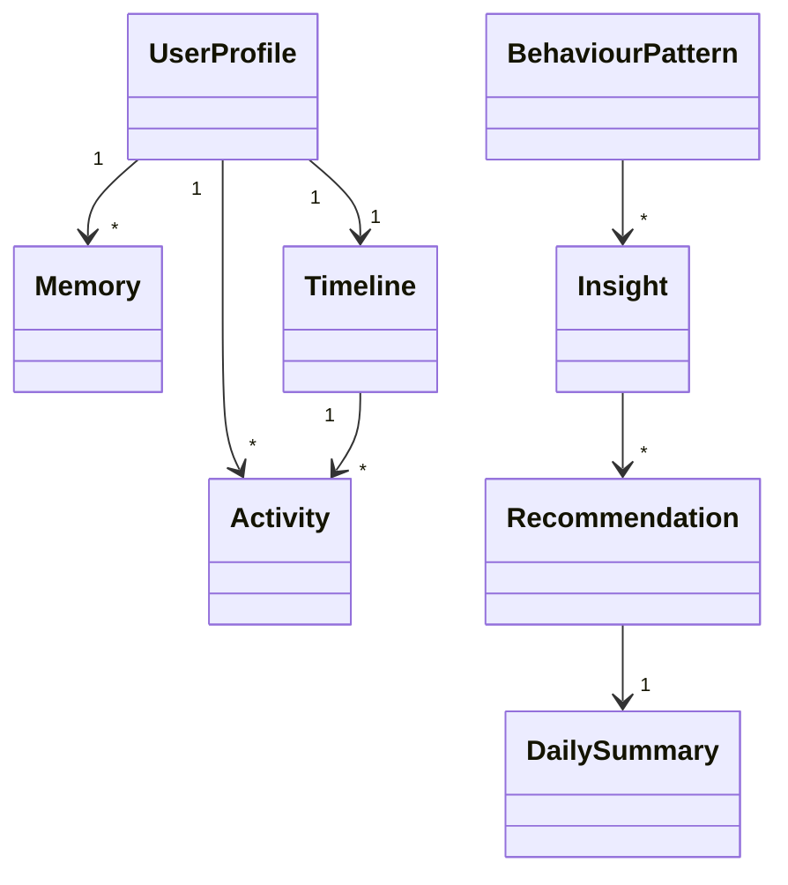
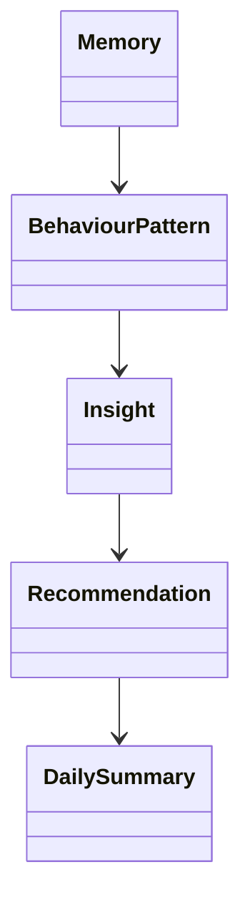

# Data Models

## Project

**LifeGraph — AI-Powered Personal Intelligence Engine**

**Version:** 1.0

**Status:** Canonical Data Contract

---

# 1. Purpose

This document defines every major data structure used by LifeGraph.

It serves as the canonical specification for:

* Pydantic models
* SQLModel entities
* Graph state
* API request/response contracts
* Database mapping
* Validation rules

Implementation must follow this document.

---

# 2. Data Modeling Principles

LifeGraph models are designed around the business domain, not the database.

Every model should satisfy:

* Single responsibility
* Strong typing
* Validation
* Serialization
* Explainability
* Extensibility

---

# 3. Model Categories

The application contains four categories of models.

```text
Domain Models
    │
    ├── User
    ├── Activity
    ├── Timeline
    ├── Memory
    ├── Insight
    └── Recommendation

Graph Models
    │
    └── LifeGraphState

API Models
    │
    ├── Requests
    └── Responses

Persistence Models
    │
    └── SQLModel Entities
```

---

# 4. Core Domain Model Relationships



---

# 5. UserProfile

## Purpose

Represents the long-term understanding of a user.

This is **not** merely an account.

It is the central intelligence model around which personalization is built.

---

## Responsibilities

The UserProfile stores:

* Identity
* Goals
* Interests
* Active Projects
* Stable Preferences
* Behaviour Summary
* Metadata

---

## Ownership

Created by:

Onboarding Service

Updated by:

* Memory Node
* Behaviour Node
* User Profile Service

---

## Lifecycle

```text
Onboarding
      │
      ▼
Create Profile
      │
      ▼
Store
      │
      ▼
Retrieve
      │
      ▼
Update
      │
      ▼
Persist
```

---

## Fields

| Field           | Type      | Required | Description        |
| --------------- | --------- | -------- | ------------------ |
| id              | UUID      | Yes      | User identifier    |
| name            | str       | Yes      | Display name       |
| occupation      | str       | Yes      | Profession         |
| timezone        | str       | Yes      | Timezone           |
| goals           | list[str] | Yes      | Long-term goals    |
| interests       | list[str] | No       | Stable interests   |
| active_projects | list[str] | No       | Current projects   |
| preferences     | dict      | No       | User preferences   |
| created_at      | datetime  | Yes      | Creation timestamp |
| updated_at      | datetime  | Yes      | Last update        |

---

## Validation Rules

* Name cannot be empty.
* Goals must contain at least one value.
* Projects must be unique.
* Timezone must follow IANA format.

---

## Example JSON

```json
{
  "id": "usr_001",
  "name": "Shreyash",
  "occupation": "AI Engineer",
  "timezone": "Asia/Kolkata",
  "goals": [
    "Become AI Engineer",
    "Build AI Products"
  ],
  "active_projects": [
    "LifeGraph",
    "G-Pilot"
  ]
}
```

---

# 6. Activity

## Purpose

Represents one structured activity extracted from natural language.

Activities are immutable observations.

They are **not** long-term knowledge.

---

## Ownership

Created by:

Activity Node

Updated by:

Never

Activities are immutable after validation.

---

## Lifecycle

```text
Natural Language

↓

Structured Activity

↓

Validation

↓

Persist

↓

Timeline

↓

Evidence
```

---

## Fields

| Field           | Type      | Description                  |
| --------------- | --------- | ---------------------------- |
| id              | UUID      | Activity ID                  |
| timestamp       | datetime  | Time of occurrence           |
| raw_text        | str       | Original activity            |
| normalized_text | str       | Cleaned text                 |
| category        | str       | Deep Work, Meeting, Learning |
| subcategory     | str       | Optional classification      |
| duration        | int       | Minutes                      |
| intent          | str       | Activity purpose             |
| project         | str       | Associated project           |
| people          | list[str] | Mentioned people             |
| location        | str       | Optional                     |
| confidence      | float     | AI confidence                |
| metadata        | dict      | Extra structured data        |
| evaluation_score  | float \| None | LLM-as-judge quality score (0–1) |
| evaluation_reason | str \| None   | Judge feedback / retry reason    |
| retry_count       | int           | Quality-retry attempts (max 2)   |
| validated         | bool          | Passed the Evaluation gate       |

The last four fields are evaluation metadata populated by the Evaluation node
(see docs/08 §"Evaluation Intelligence Contract"). They are retained on the
activity for later analytics.

---

## Validation Rules

* Confidence between 0 and 1.
* Duration ≥ 0.
* Timestamp required.
* Raw text required.
* evaluation_score, when present, is between 0 and 1.

---

## Example

```json
{
  "category": "Deep Work",
  "project": "LifeGraph",
  "duration": 120,
  "intent": "Implementation",
  "confidence": 0.96
}
```

---

# 7. Timeline

## Purpose

Represents the chronological reconstruction of a user's day.

Unlike activities, the timeline groups observations into meaningful sessions.

---

## Responsibilities

* Order activities
* Calculate duration
* Build sessions
* Detect context switches

---

## Fields

| Field            | Type           |
| ---------------- | -------------- |
| date             | date           |
| activities       | list[Activity] |
| sessions         | list[Session]  |
| total_duration   | int            |
| context_switches | int            |

---

## Example

```text
09:00–11:00
Deep Work

11:15–12:00
Meeting

13:00–15:00
Learning

16:00–18:00
Coding
```

---

# 8. Session

## Purpose

Represents uninterrupted work on a single context.

Sessions are built from activities.

---

## Fields

| Field             | Type           |
| ----------------- | -------------- |
| start_time        | datetime       |
| end_time          | datetime       |
| duration          | int            |
| activities        | list[Activity] |
| dominant_category | str            |
| dominant_project  | str            |
| focus_score       | float          |

---

## Validation

* End time must be after start time.
* Focus score between 0 and 1.

---

# Part 1 Summary

The core domain models establish the foundation of LifeGraph.

Key principles:

* Activities are immutable observations.
* Timelines organize observations.
* Sessions represent uninterrupted work.
* UserProfile evolves over time.

Subsequent sections will define:

* Memory
* BehaviourPattern
* Insight
* Recommendation
* DailySummary
* LifeGraphState
* API contracts
* SQLModel mappings
* Validation schemas

# 9. Memory

## Purpose

Memory represents persistent knowledge that the system has learned about the user.

Unlike Activities, memories are **not observations**.

They are conclusions supported by repeated evidence.

Memory is the foundation of personalization.

---

# Memory Philosophy

LifeGraph follows a strict progression.

```text id="l7c3qf"
Activity

↓

Observation

↓

Evidence

↓

Pattern

↓

Memory
```

Skipping any stage is prohibited.

---

# Ownership

Created By

Memory Node

Updated By

Memory Node

Read By

* Context Node
* Behaviour Node
* Recommendation Node
* Summary Node

---

# Lifecycle

```text id="stp40b"
Observation

↓

Evidence

↓

Confidence Evaluation

↓

Memory Proposal

↓

Validation

↓

Persist
```

---

# Memory Categories

LifeGraph supports multiple memory domains.

```text id="fjlwm2"
Identity

Goals

Projects

Routine

Behaviour

Preferences

Interests

Decision History
```

Each category evolves independently.

---

# Memory Schema

| Field                   | Type            | Description                       |
| ----------------------- | --------------- | --------------------------------- |
| id                      | UUID            | Memory identifier                 |
| type                    | MemoryType      | Category                          |
| statement               | str             | Learned fact                      |
| confidence              | float           | Confidence score                  |
| evidence_count          | int             | Supporting observations           |
| supporting_activity_ids | list[UUID]      | Source evidence                   |
| created_at              | datetime        | Creation timestamp                |
| updated_at              | datetime        | Last modification                 |
| expires_at              | datetime | None | Optional expiration               |
| metadata                | dict            | Additional structured information |

---

# Validation Rules

* Confidence between 0 and 1.
* Evidence count ≥ 1.
* Statement cannot be empty.
* Memory type required.

---

# Example

```json id="0c4wdq"
{
  "type": "routine",
  "statement": "User prefers coding in the morning.",
  "confidence": 0.93,
  "evidence_count": 17
}
```

---

# Memory Update Rules

Memory should only change when evidence changes.

Examples

Existing Memory

```text id="n49gs7"
Morning coding
Confidence 0.72
```

After new evidence

↓

```text id="dcjx0q"
Morning coding

Confidence 0.89
```

No new memory is created.

Existing knowledge evolves.

---

# Memory Types

## IdentityMemory

Examples

* Preferred name
* Occupation
* Timezone

Rarely changes.

---

## GoalMemory

Examples

* Become AI Engineer
* Learn Reinforcement Learning
* Build AI Startup

Changes occasionally.

---

## ProjectMemory

Examples

* LifeGraph
* G-Pilot
* Agrovers

Projects may become inactive.

---

## RoutineMemory

Examples

* Studies every morning.
* Exercises at 6 PM.

Highly dynamic.

---

## BehaviourMemory

Examples

* Frequently context switches.
* Consistent deep worker.

Generated from behavioural analysis.

---

## PreferenceMemory

Examples

* Prefers Python.
* Uses VS Code.
* Works in dark mode.

---

## InterestMemory

Examples

* Agentic AI
* Distributed Systems
* System Design

Derived from repeated activities.

---

# 10. BehaviourPattern

## Purpose

Represents behavioural trends detected from accumulated history.

Unlike Memory,

Behaviour Patterns describe

**how the user behaves.**

---

# Ownership

Generated By

Behaviour Node

Read By

* Insight Node
* Recommendation Node
* Summary Node

---

# Behaviour Categories

```text id="7gv1qg"
Productivity

Focus

Routine

Learning

Context Switching

Meetings

Energy

Work Style
```

---

# Schema

| Field       | Type              |
| ----------- | ----------------- |
| id          | UUID              |
| category    | BehaviourCategory |
| title       | str               |
| description | str               |
| confidence  | float             |
| evidence    | list[UUID]        |
| trend       | TrendDirection    |
| importance  | int               |

---

# Example

```json id="9lyuy9"
{
  "category": "Focus",
  "title": "Morning Deep Work",
  "confidence": 0.91,
  "trend": "Increasing"
}
```

---

# TrendDirection

Supported values

```text id="9glpkz"
Increasing

Stable

Decreasing

Unknown
```

---

# Behaviour Lifecycle

```text id="qdr7z7"
Activities

↓

Timeline

↓

Statistics

↓

Behaviour Detection

↓

Behaviour Pattern
```

---

# 11. Insight

## Purpose

Insights explain what has changed.

Insights never tell the user what to do.

---

# Ownership

Generated By

Insight Node

---

# Responsibilities

Communicate

* Progress
* Regression
* Behaviour
* Trends

---

# Schema

| Field       | Type       |
| ----------- | ---------- |
| id          | UUID       |
| title       | str        |
| description | str        |
| confidence  | float      |
| evidence    | list[UUID] |
| importance  | int        |

---

# Example

```json id="bdvgk0"
{
  "title": "Morning productivity improved.",
  "confidence": 0.94
}
```

---

# Insight Rules

Every insight must reference evidence.

Unsupported insights are rejected.

---

# 12. Recommendation

## Purpose

Recommendations convert understanding into action.

---

# Ownership

Generated By

Recommendation Node

---

# Responsibilities

Recommend

* Behaviour improvements
* Schedule adjustments
* Learning priorities
* Project focus

---

# Schema

| Field           | Type       |
| --------------- | ---------- |
| id              | UUID       |
| title           | str        |
| reason          | str        |
| evidence        | list[UUID] |
| expected_impact | str        |
| priority        | Priority   |
| confidence      | float      |

---

# Priority

```text id="8gprjl"
Critical

High

Medium

Low
```

---

# Example

```json id="39c0hr"
{
  "title": "Schedule coding before lunch.",
  "priority": "High",
  "reason": "Morning focus consistently exceeds afternoon focus."
}
```

---

# Recommendation Rules

Every recommendation must include

* Why
* Supporting evidence
* Expected impact

No generic advice allowed.

---

# 13. DailySummary

## Purpose

Represents the final narrative produced for the user.

This is the primary user-facing artifact.

---

# Ownership

Generated By

Summary Node

---

# Schema

| Field           | Type                 |
| --------------- | -------------------- |
| id              | UUID                 |
| date            | date                 |
| overview        | str                  |
| timeline        | str                  |
| metrics         | dict                 |
| insights        | list[Insight]        |
| recommendations | list[Recommendation] |
| tomorrow_focus  | str                  |

---

# Required Sections

* Executive Summary
* Timeline
* Productivity Metrics
* Behaviour Analysis
* Insights
* Recommendations
* Reflection
* Tomorrow's Focus

---

# Example Structure

```text id="b9wjf4"
Today's Summary

Overview

Timeline

Behaviour

Insights

Recommendations

Tomorrow
```

---

# Relationships



---

# Intelligence Pipeline

The intelligence layer follows this progression.

```text id="c3kzyl"
Activity

↓

Memory

↓

Behaviour

↓

Insight

↓

Recommendation

↓

Summary
```

Each stage builds on validated information from the previous stage.

No stage should infer data without evidence.

---

# Engineering Rules

These models represent **learned intelligence**, not raw data.

Therefore:

* Every object must be explainable.
* Every conclusion must reference evidence.
* Confidence is mandatory.
* Models should remain immutable once persisted, except where explicit updates are defined.
* AI-generated content must always be validated before persistence.

The integrity of these models is essential because they directly influence personalization and user trust.

# 14. LifeGraphState

## Purpose

`LifeGraphState` is the central data contract of the entire application.

Every LangGraph node receives the current state, enriches it with new information, and returns an updated state.

No node communicates directly with another node.

All communication occurs exclusively through `LifeGraphState`.

This makes the workflow deterministic, testable, observable, and easy to extend.

---

# Philosophy

Think of `LifeGraphState` as the application's working memory.

It contains:

* Current activity
* Structured understanding
* Relevant context
* Timeline
* Long-term memories
* Behaviour patterns
* Insights
* Recommendations
* Execution metadata

As execution progresses, the state becomes progressively richer.

---

# Lifecycle

```text id="jepdnn"
Initialize State
        │
        ▼
Activity Node
        │
        ▼
Context Node
        │
        ▼
Memory Node
        │
        ▼
Timeline Node
        │
        ▼
Behaviour Node
        │
        ▼
Insight Node
        │
        ▼
Recommendation Node
        │
        ▼
Summary Node
        │
        ▼
Reflection Node
        │
        ▼
Persist
```

---

# Ownership

Created By

* Graph Builder

Updated By

* Every node

Destroyed

* End of execution

Persisted

* Checkpointer
* Database Services

---

# Conceptual Schema

```python id="h7r6nv"
LifeGraphState

execution_id

user_profile

current_activity

structured_activity

relevant_context

timeline

memories

memory_proposals

behaviour_patterns

insights

recommendations

daily_summary

execution_metadata

confidence_scores

errors
```

This represents the complete execution state.

---

# State Ownership Matrix

| Field               | Owner               |
| ------------------- | ------------------- |
| execution_id        | Graph Builder       |
| user_profile        | User Service        |
| current_activity    | Activity Node       |
| structured_activity | Activity Node       |
| relevant_context    | Context Node        |
| timeline            | Timeline Node       |
| memories            | Memory Node         |
| memory_proposals    | Memory Node         |
| behaviour_patterns  | Behaviour Node      |
| insights            | Insight Node        |
| recommendations     | Recommendation Node |
| daily_summary       | Summary Node        |
| execution_metadata  | Reflection Node     |
| confidence_scores   | Reflection Node     |
| errors              | Reflection Node     |

Nodes must never update fields they do not own.

---

# Execution Metadata

Execution metadata provides observability without affecting reasoning.

Recommended fields:

| Field              | Purpose                     |
| ------------------ | --------------------------- |
| execution_id       | Unique execution identifier |
| graph_version      | Workflow version            |
| prompt_versions    | Prompt tracking             |
| model_name         | Groq model used             |
| total_runtime_ms   | Execution duration          |
| retry_count        | Number of retries           |
| node_timings       | Per-node latency            |
| validation_results | Validation status           |

---

# Confidence Scores

Every reasoning stage contributes confidence.

```text id="svr3yy"
Activity

0.97

Memory

0.84

Behaviour

0.90

Insight

0.92

Recommendation

0.88

Summary

0.95
```

Overall confidence should never be derived from a simple average.

It should be interpreted independently by downstream services.

---

# Error Collection

Errors should accumulate rather than terminate execution whenever possible.

Example

```text id="cvlxsi"
Activity

Success

↓

Memory

Success

↓

Behaviour

Groq Timeout

↓

Retry

↓

Recovered

↓

Continue
```

The graph should remain resilient.

---

# State Evolution Example

Initial State

```json id="ep4w4g"
{
    "current_activity":
    "Worked on LifeGraph backend for two hours."
}
```

↓

After Activity Node

```json id="ynxqzk"
{
    "structured_activity":
    {
        "category":"Deep Work",
        "project":"LifeGraph",
        "duration":120
    }
}
```

↓

After Context Node

```json id="ehztyh"
{
    "relevant_context":
    {
        "active_project":"LifeGraph",
        "goal":"Build AI Startup"
    }
}
```

↓

After Memory Node

```json id="zrydb9"
{
    "memory_proposals":[
        {
            "statement":
            "LifeGraph is an active project."
        }
    ]
}
```

The state grows continuously throughout execution.

---

# State Immutability

Business entities should be treated as immutable whenever possible.

Rather than mutating:

```text id="3ng1ei"
state.memory.confidence = 0.95
```

Prefer

```text id="hh6e7d"
state = state.model_copy(
    update={
        ...
    }
)
```

This improves:

* Debugging
* Traceability
* Testing
* Rollbacks

---

# 15. API Models

API models define the public contract of the backend.

They should be independent of internal models.

Never expose internal graph structures directly.

---

# Request Models

Version 1 requires the following request DTOs.

## LogActivityRequest

Purpose

Receive a new activity.

Fields

| Field     | Type                |
| --------- | ------------------- |
| activity  | str                 |
| timestamp | datetime (optional) |

---

## GenerateSummaryRequest

Purpose

Request an end-of-day summary.

Fields

| Field | Type |
| ----- | ---- |
| date  | date |

---

## UpdateProfileRequest

Fields

* Goals
* Projects
* Interests
* Preferences

Only editable profile information should be accepted.

---

# Response Models

## ActivityResponse

Contains

* Structured Activity
* Confidence
* Timeline Status

---

## TimelineResponse

Contains

* Sessions
* Activities
* Statistics

---

## MemoryResponse

Contains

* Active Memories
* Confidence
* Evidence Counts

---

## SummaryResponse

Contains

* Daily Summary
* Behaviour
* Insights
* Recommendations

---

# API Design Rules

API models should:

* Hide implementation details.
* Never expose GraphState.
* Never expose SQL entities.
* Never expose internal prompt metadata.

Only business information should be returned.

---

# 16. Persistence Models

Persistence models represent database tables.

Unlike domain models,

they are optimized for storage.

Responsibilities

* Database mapping
* Relationships
* Indexes
* Foreign keys

No business logic belongs here.

---

# Persistence Flow

```text id="5d4z3q"
Domain Model

↓

Repository

↓

Persistence Model

↓

SQLite

↓

Persistence Model

↓

Repository

↓

Domain Model
```

Repositories perform the conversion.

---

# 17. Model Validation Strategy

Every model follows the same lifecycle.

```text id="lptzqh"
Incoming Data

↓

Pydantic Validation

↓

Business Validation

↓

Graph Processing

↓

Persistence Validation

↓

Database
```

Validation occurs at every boundary.

---

# 18. Engineering Rules

Every model must satisfy:

* Single responsibility.
* Strong typing.
* JSON serializable.
* Versionable.
* Explainable.
* Independently testable.
* Immutable where practical.

No model should combine business logic with persistence logic.

---

# Data Contract Summary

The application revolves around three model families:

```text id="frkz3s"
Domain Models

↓

Graph Models

↓

Persistence Models
```

Each family has a distinct responsibility.

Maintaining this separation keeps the architecture clean, reduces coupling, and allows individual layers to evolve independently.

The data contract defined in this document should be treated as the **single source of truth** for all application models.
